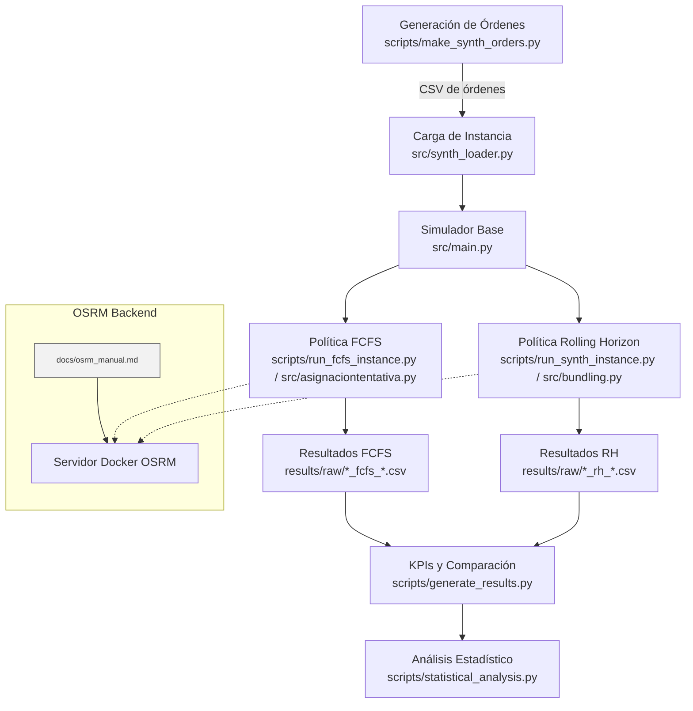

# Documentación Técnica para Capítulo 4

Este documento resume la arquitectura del proyecto MDRP-BCS, el flujo de integración con OSRM y los esquemas de datos utilizados en los archivos CSV generados por el pipeline experimental. Sirve como insumo directo para el Capítulo 4 de la tesis.

## 1. Arquitectura del Sistema

El sistema se organiza en módulos que cubren generación de datos sintéticos, ejecución de políticas de asignación (FCFS y Rolling Horizon), cálculo de KPIs y análisis estadístico. El contenedor de OSRM funciona como servicio externo que provee tiempos y distancias realistas.



### Componentes Clave
- **Generación de órdenes** (`scripts/make_synth_orders.py`): reproduce patrones horarios de LaDe para generar `data/synthetic_lapaz_orders_limited.csv`.
- **Simulador base** (`src/main.py`): motor compartido por ambas políticas; coordina eventos, estados de couriers y actualización de métricas.
- **Política FCFS** (`scripts/run_fcfs_instance.py`, `src/asignaciontentativa.py`): asigna órdenes en el orden recibido sin agrupar.
- **Política Rolling Horizon** (`scripts/run_synth_instance.py`, `src/bundling.py`): reoptimiza cada ventana de tiempo y construye bundles con el nuevo tope configurable.
- **Integración OSRM** (`src/getrouteOSMR.py`): encapsula llamadas a `/route` y aplica fallback euclidiano ante fallas.
- **Orquestación de KPIs** (`scripts/generate_results.py`): consolida métricas de orden y courier, además de producir `results/kpi_comparison.csv`.
- **Análisis estadístico** (`scripts/statistical_analysis.py`): calcula pruebas de hipótesis y tamaños de efecto para tiempos y proporciones de bundles.

## 2. Flujo de Integración con OSRM

1. **Preparación de datos**: seguir `docs/osrm_manual.md` para ejecutar `osrm-extract`, `osrm-partition` y `osrm-customize` usando el perfil `car.lua`.
2. **Arranque del servidor**:
   ```powershell
   docker run -t -i -p 5000:5000 -v C:\Users\alan_\Documents\GitHub\MDRP-BCS-code:/data osrm/osrm-backend osrm-routed --algorithm mld /data/mexico-251010.osrm
   ```
3. **Consumo en simulación**:
   - Las funciones de ruteo construyen requests `GET /route/v1/driving/{lon},{lat};...`.
   - `src/getrouteOSMR.py` administra reintentos y tiempos de espera.
   - En caso de `code != "Ok"`, se utiliza distancia haversine para no detener el ciclo.
4. **Diagnóstico**: cualquier ajuste de tiempo de espera o saturación debe consultarse en la sección *Troubleshooting* del manual.

> **Verificación:** El manual `docs/osrm_manual.md` contiene referencias actualizadas a comandos, perfiles (`car.lua`) y procedimientos de resolución de problemas. No se requieren cambios adicionales para el Capítulo 4.

## 3. Esquemas de Datos CSV

### 3.1 Órdenes Sintéticas (`data/synthetic_lapaz_orders_limited.csv`)

| Columna         | Tipo       | Descripción                                                                 |
|-----------------|------------|------------------------------------------------------------------------------|
| `order_id`      | int        | Identificador único incremental de la orden.                                 |
| `restaurant_id` | int        | Índice del restaurante asignado durante la generación.                      |
| `created_at`    | datetime   | Timestamp del pedido colocado (zona horaria local de La Paz).               |
| `ready_at`      | datetime   | Estimado en que el restaurante tiene la orden lista para recoger.           |
| `rest_lat`      | float      | Latitud del restaurante.                                                    |
| `rest_lon`      | float      | Longitud del restaurante.                                                   |
| `dest_lat`      | float      | Latitud del cliente.                                                        |
| `dest_lon`      | float      | Longitud del cliente.                                                       |

### 3.2 Resultados por Orden

Se generan dos archivos análogos para cada política:
- `results/raw/synthetic_lapaz_orders_limited_fcfs_results.csv`
- `results/raw/synthetic_lapaz_orders_limited_rh_results.csv`

| Columna          | Tipo       | Descripción                                                                               |
|------------------|------------|------------------------------------------------------------------------------------------|
| `order_id`       | int        | Identificador de la orden (coincide con el CSV de entrada).                              |
| `status`         | string     | Estado final (`delivered`, `cancelled`, etc.; en práctica todas entregadas).             |
| `placement_time` | datetime   | Hora en que el cliente realizó el pedido.                                                |
| `ready_time`     | datetime   | Hora en que el restaurante marcó la orden como lista.                                    |
| `pickup_time`    | datetime   | Momento en que el courier recogió la orden.                                              |
| `delivery_time`  | datetime   | Hora de entrega al cliente.                                                              |
| `click_to_door`  | float (min)| Minutos transcurridos desde `placement_time` hasta `delivery_time`.                      |
| `ready_to_pickup`| float (min)| Minutos desde `ready_time` hasta `pickup_time`.                                           |
| `courier_id`     | int        | Identificador del courier que completó la entrega.                                       |
| `bundle_size`    | int        | Número de órdenes agrupadas en la misma ruta.                                            |

### 3.3 Resumen por Courier

Archivos disponibles:
- `results/raw/synthetic_lapaz_orders_limited_fcfs_couriers.csv`
- `results/raw/synthetic_lapaz_orders_limited_rh_couriers.csv`

| Columna                 | Tipo       | Descripción                                                                    |
|-------------------------|------------|---------------------------------------------------------------------------------|
| `courier_id`            | int        | Identificador del courier.                                                     |
| `orders_delivered`      | int        | Número total de órdenes entregadas por ese courier.                            |
| `total_distance_km`     | float      | Distancia total recorrida (kilómetros).                                        |
| `shift_duration_hours`  | float      | Duración del turno asignada al courier (horas).                                |
| `bundles_picked_up`     | int        | Conteo de bundles recogidos (equivale a órdenes para FCFS).                    |
| `driving_time_minutes`  | float      | Tiempo efectivo conduciendo (minutos).                                         |

### 3.4 KPIs Consolidados (`results/kpi_comparison.csv`)

| Columna                               | Tipo     | Descripción                                                                                  |
|---------------------------------------|----------|----------------------------------------------------------------------------------------------|
| `Policy`                              | string   | Nombre de la política (`FCFS`, `Rolling Horizon`, `Improvement (%)`).                        |
| `Avg. Click-to-Door (min)`            | float    | Promedio de `click_to_door` en minutos.                                                      |
| `P10`/`P50`/`P90`/`P95` Click-to-Door | float    | Percentiles correspondientes de `click_to_door`.                                             |
| `Avg.`/`P10`/`P50`/`P90` Ready-to-*   | float    | Percentiles sobre `ready_to_pickup` y `ready_to_door`.                                        |
| `% Undelivered Orders`                | float    | Porcentaje de órdenes no entregadas.                                                         |
| `Total Distance (km)`                 | float    | Caminos recorridos acumulados por todos los couriers.                                        |
| `Distance per Order (km)`             | float    | Distancia promedio recorrida por orden entregada.                                            |
| `Orders per Courier per Hour`         | float    | Productividad promedio de couriers.                                                          |
| `Bundles per Hour`                    | float    | Bundles (o equivalentes) por hora de trabajo.                                                |
| `Avg. Bundle Size`                    | float    | Tamaño promedio de bundle.                                                                   |
| `% Orders in Multi-Bundles`           | float    | Porcentaje de órdenes con `bundle_size > 1`.                                                 |
| `Total Courier Compensation`          | float    | Compensación total estimada (mínimo garantizado vs pago por orden).                          |
| `Cost per Order`                      | float    | Costo promedio por orden en términos de compensación.                                        |
| `Fraction of Couriers with Minimum Compensation` | float | Proporción de couriers que requirieron ajuste al mínimo por hora.                           |
| `Click-to-Door Overage (min)`         | float    | Exceso promedio sobre el objetivo de 40 minutos.                                             |
| `Courier Utilization (%)`             | float    | Porcentaje de uso activo del tiempo del courier.                                             |
| `Courier Delivery Earnings`           | float    | Suma de ingresos por entrega (antes de topes mínimos).                                       |

---

### Uso en el Capítulo 4
- Incluir el diagrama de arquitectura y la descripción de cada módulo en la sección de diseño e implementación.
- Referenciar `docs/osrm_manual.md` como manual operativo para despliegue del backend de ruteo.
- Incorporar las tablas anteriores para documentar el formato de los datasets que acompañan los experimentos.
